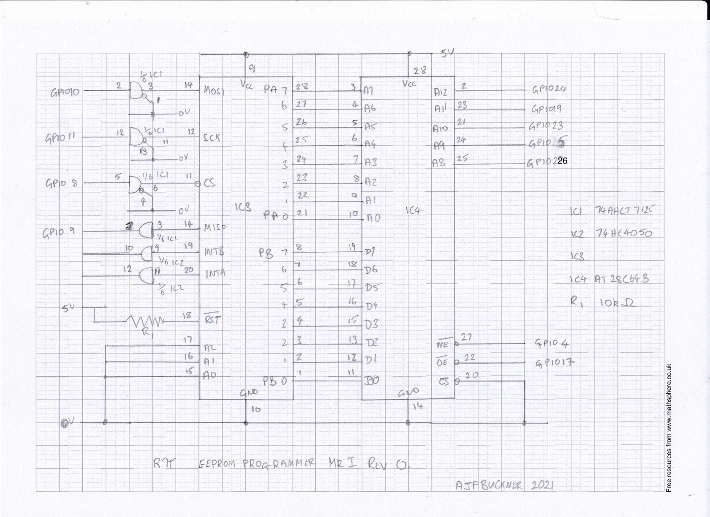

# Introduction
This project is now no longer under active development.

This is a simple 28C64 EEPROM programmer for Rasperry Pis using an MCP23S17
port expander and some level-shifting.

Currently, it can only read in Motorola S-Record files. However, it also has has
an interactive mode.

# Usage

```
Usage:
  eeprog [OPTION?] - MCP23S17.

Help Options:
  -h, --help            Show help options

Application Options:
   -a, --address         MCP hardware address
  -c, --spiclock        SPI clock divider
  -b, --rombase         ROM base address
  -s, --memsize         ROM size (bytes)
  -r, --read            Read ROM
  -w, --write           Write ROM
  -y, --verify          Verify ROM
  -x, --erase           Erase ROM
  -i, --interactive     Interactive
  -v, --verbose         Verbose mode
  -m, --method          Programming method
  -e, --erasebyte       Erase value
  -f, --format          Format
  -t, --testmode        Test mode
  -d, --delay           Programming delay (usec)
  -p, --pulsewidth      Write enable pulse width (usec)
  -l, --linelen         Output line length (bytes)
  -z, --buffersize      Input buffer size (bytes)
  -D, --device          Device type
```
# Options

## -a	
The address of the 23S17. This the number set on the chip's hardware address pins. It defaults to 0.

## -c 
This determines the SPI clock rate. See the bcm2835 library for details. The default value is
64, giving a clock frequency 3.90625MHz on Rpi2, 6.250MHz on RPi3. This is the fastest value
that I have found to be reliable on my breadboard prototype with an RPi3.

## -b 
Set the base address that the EEPROM will reside at when in use. This value is subtracted from
addresses in the input file to give the EEPROM address.

## -s
Size of the EEPROM in bytes. Default value is 0x2000.

## -r
Read the contents of the EEPROM and print. If the format is set to S19 using the -f flag,
use S19 format otherwise dumo in hexadecimanl.

## -w
Program the EEPROM. An input file must be specified for eeprog to be happy.

## -y
Verify the contents of the EEPROM against a specified file *not yet implemented*.

## -x
Erase the EEPROM: set all bytes to the value sepecfed by the -e flag or 0xff if not.

## -i
Enter interactive mode. The address counter starts at the EEPROM base address.
Entering just '.' + return will exit. A blank line advances the address
counter by one. Typing '-' + return will decrement the address counter. Typing @hhhhh will allow to set the 
address counter to hhhh (hex). Typing in a hex byte will program it in. All addresses have the base address
subtracted. So, if the base address is 0xe000, then @e0010 will allow you to program into the
16th location in the EEPROM. Confused? Good.

## -v
Be verbose.

## -m 0|1
Set the programming method. Mode 0 pauses by delay microseconds after programming a bytes. The
default (10,000) should be good for 28c42 chips.  

Mode 1 (*not tested*) will read back the location just programmed and wait until the value
read back matches the one just written.

## -e BYTE
Set the value to be written to all EEPROM locations when erasing. Default 0xff.

## -f FORMAT
Specify the data file format. Currently ignored for programming (must be S19) and defaults to a
hex dump format for reading.

## -t
Test mode - don't actually program the EEPROM.

## -d DELAY
Set the delay (base 10) in microseconds between programming each byte in modes 0 and 3.

# The configuration file.
Currently this is hardwired to /home/pi/.eepromrc. Since you're running it on a Pi
and you need to run the code as root, perhaps this isn't as stupid as it seems.

This allows to set up the pins and ports. Pin numbers are BCM 2835 GPIO pin numbers. 
If data is set to B, then port B will be used for the EEPROM data and A for the low
order (bits 0 to 7) addresses. If 'B' the other way round. This must be set. OE
and WE allow to specify the GPIO pins for the EEPROM's output enable and write
enable pins. A8 to A12 specify the high order address pins - currently only EEPROMs
with a size of no more than 8kbytes can be programmed.

An example file is given below.  

```
[GPIO]
A8=26
A9=5
A10=23
A11=19
A12=24
OE=17
WE=4

[MCP23S17]
SPIaddress=0
data=B
```

# Circuit Diagram


